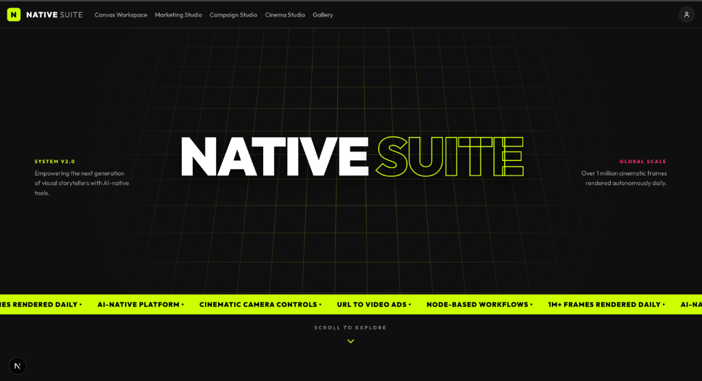
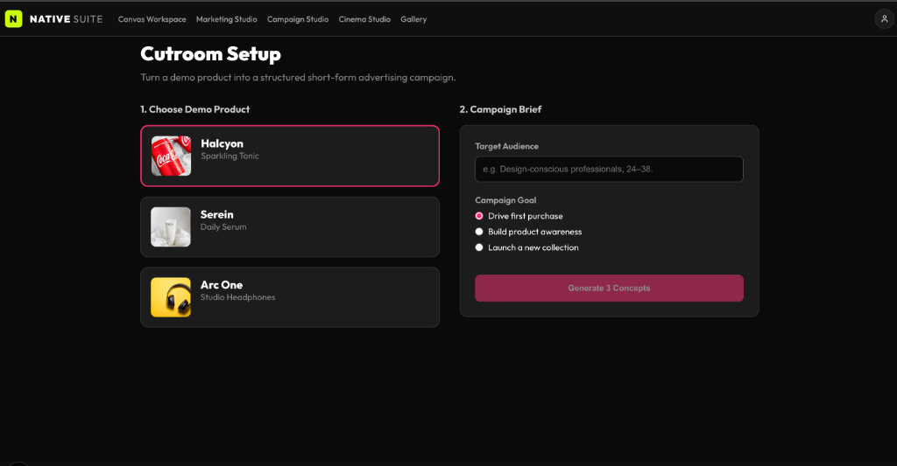
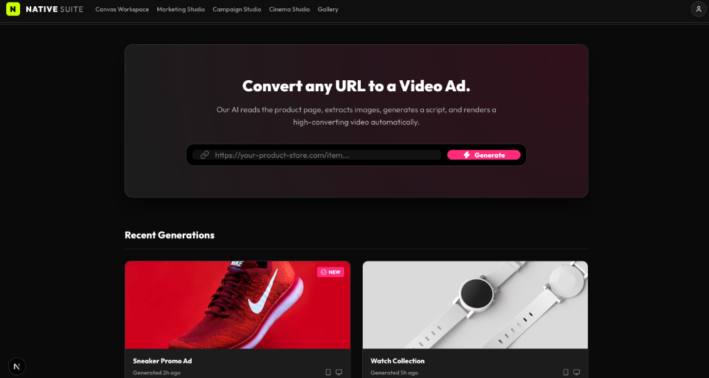
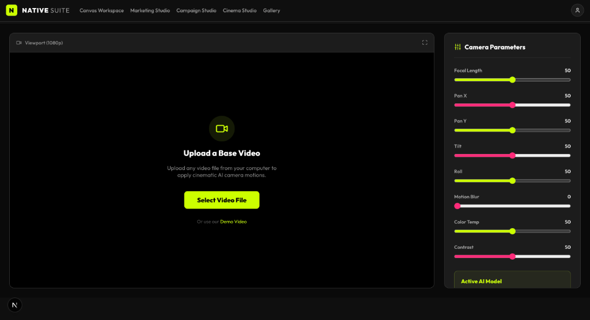
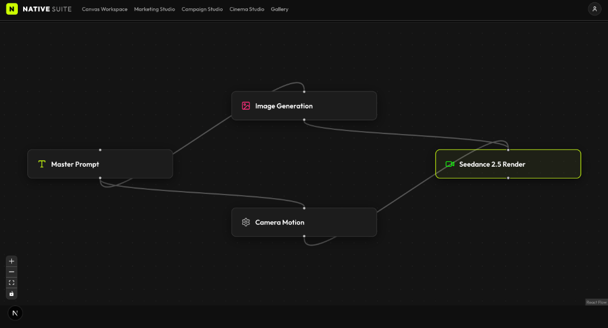

# Native Suite (System v2.0)



Native Suite is a cutting-edge, AI-native creative platform designed to empower the next generation of visual storytellers. By combining intuitive user interfaces with deterministic AI workflows, Native Suite allows users to seamlessly generate, control, and export high-converting marketing campaigns and cinematic video sequences entirely within their browser.

Everything is designed to be highly interactive, deeply modular, and completely deterministic.

---

## 🚀 Core Features & Studios

The suite is divided into four primary workspaces, each dedicated to a specific part of the creative AI workflow.

### 1. Campaign Studio (Cutroom)

Turn a demo product into a structured, short-form advertising campaign. 
- **Deterministic Briefs:** Select a target audience and campaign goal.
- **Concept Generation:** The AI creates 3 distinct creative concepts with unique tones and hooks.
- **Editable Storyboard:** A 5-shot timeline where you can edit the title, duration, action, and *camera motion* for every shot.
- **Interactive Vertical Preview:** Press play to watch the actual CSS-animated camera motions (pan, zoom, tilt) play out in real-time synced to your storyboard!

### 2. Marketing Studio

Convert any product URL into a high-converting video ad instantly.
- Enter a product URL (like a Shopify page).
- The studio simulates extracting assets and instantly generates a cohesive video ad based on the product data.
- View recent generation history in a beautiful grid.

### 3. Cinema Studio

Advanced virtual camera controls applied to static imagery or videos.
- Upload any image/video or use a remote demo video.
- Precisely tweak focal length, pan X/Y, tilt, roll, motion blur, color temperature, and contrast using reactive sliders.
- **Local Export:** Safely bypasses browser CORS restrictions to instantly download the rendered MP4 right to your local machine.

### 4. Canvas Workspace

Node-based visual AI pipelines.
- Build complex generative workflows by visually connecting nodes (Master Prompt → Image Generation → Camera Motion → Render).
- Perfect for power users who want ultimate control over the generative AI pipeline routing.

---

## 🛠️ Technology Stack

- **Framework:** [Next.js 16](https://nextjs.org/) (App Router)
- **Styling:** Vanilla CSS & Inline Styles for maximum flexibility and control
- **Animations:** [Framer Motion](https://www.framer.com/motion/) for buttery-smooth page transitions, micro-interactions, and complex layout animations
- **Icons:** [Lucide React](https://lucide.dev/)
- **Authentication:** [Supabase](https://supabase.com/) (Email & Password native integration)
- **Node UI:** `reactflow` for the Canvas Workspace

---

## 📦 Local Setup Instructions

1. **Clone the repository:**
   ```bash
   git clone https://github.com/YourUsername/8X-Assessment.git
   cd 8X-Assessment
   ```

2. **Install dependencies:**
   ```bash
   npm install
   ```

3. **Configure Supabase Auth:**
   - Create a project at [Supabase](https://supabase.com).
   - Ensure the "Email" authentication provider is enabled (and optionally turn off "Confirm Email" for instant sign-ins).
   - Create a `.env.local` file in the root directory:
     ```env
     NEXT_PUBLIC_SUPABASE_URL=your-project-url
     NEXT_PUBLIC_SUPABASE_ANON_KEY=your-anon-key
     ```

4. **Run the development server:**
   ```bash
   npm run dev
   ```

5. Open [http://localhost:3000](http://localhost:3000) in your browser to explore Native Suite.
